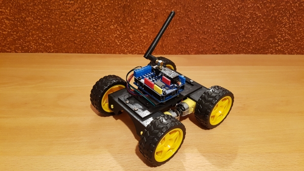
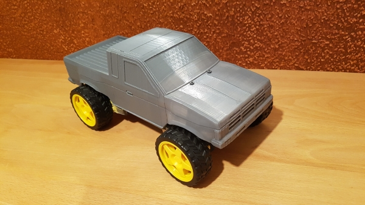

# tt-motor-mounting

## RC 4WD
You can also find the project on Thingiverse: https://www.thingiverse.com/thing:3301216
  
Requires the following parts:
<ul>
  <li>2x <a href="MotorMounting_Bridge2_length100_4scewHoles.stl">MotorMounting_Bridge2_length100_4scewHoles.stl</a></li>
  <li>1x <a href="simpleBaseFrame.stl">simpleBaseFrame.stl</a></li>
</ul>

## RC 4WD with Pickup Car Body
  
Requires the following parts:
<ul>
  <li>2x <a href="MotorMounting_Bridge2_length100_4scewHoles.stl">MotorMounting_Bridge2_length100_4scewHoles.stl</a></li>
  <li>1x <a href="frameForPickupBodyV1.1.stl">frameForPickupBodyV1.1.stl</a></li>
  <li>1x <a href="pickupBody/King_URSA_Front_body_piece.stl">King_URSA_Front_body_piece.stl</a></li>
  <li>1x <a href="pickupBody/King_URSA_Center_Body_Piece3.stl">King_URSA_Center_Body_Piece3.stl</a></li>
  <li>1x <a href="pickupBody/King_URSA_Rear_Body_Piece.stl">King_URSA_Rear_Body_Piece.stl</a></li>
</ul>
You can also find this project on Thingiverse: https://www.thingiverse.com/thing:3483392
