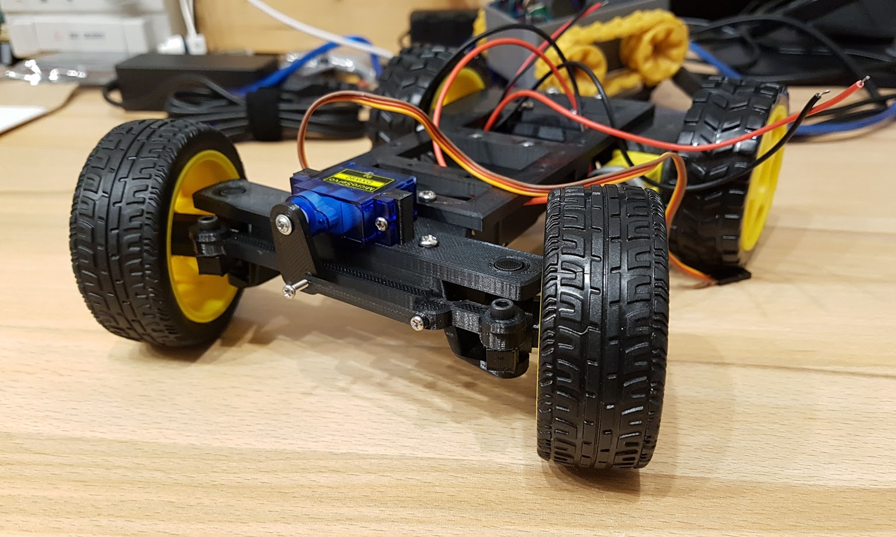

# tt-motor-mounting

This repo contains a framework for building RC Cars based on Arduino and ESP Wemos board. It contains only the designs and parts you want to 3d-print. 

## RC 4WD
You can also find the project on Thingiverse: https://www.thingiverse.com/thing:3301216
  
Requires the following parts: 

* 2x <a href="MotorMounting_Bridge2_length100_4scewHoles.stl">MotorMounting_Bridge2_length100_4scewHoles.stl</a>
* 1x <a href="simpleBaseFrame.stl">simpleBaseFrame.stl</a>
* few screws
* 4x tt-motor
* 4x wheels
* controller 
* driver board 
* remote control

## RC 4WD with Pickup Car Body
  
Requires the following parts:
* 2x <a href="MotorMounting_Bridge2_length100_4scewHoles.stl">MotorMounting_Bridge2_length100_4scewHoles.stl</a>
* 1x <a href="frameForPickupBodyV1.1.stl">frameForPickupBodyV1.1.stl</a>
* 1x <a href="pickupBody/King_URSA_Front_body_piece.stl">King_URSA_Front_body_piece.stl</a>
* 1x <a href="pickupBody/King_URSA_Center_Body_Piece3.stl">King_URSA_Center_Body_Piece3.stl</a>
* 1x <a href="pickupBody/King_URSA_Rear_Body_Piece.stl">King_URSA_Rear_Body_Piece.stl</a>
* few screws
* 4x tt-motor
* 4x wheels
* controller 
* driver board 
* remote control

You can also find this project on Thingiverse: https://www.thingiverse.com/thing:3483392

## RC Car with steering axle

Required parts: 

* 1x [simpleBaseFrameForSteering.stl](simpleBaseFrameForSteering.stl)
* 1x [MotorMounting_Bridge2_length100_4scewHoles.stl](MotorMounting_Bridge2_length100_4scewHoles.stl)
* 1x [axle_v3_crossPart.stl](steering-axle/axle_v3_crossPart.stl)
* 1x [axle_v3_lowerPart.stl](steering-axle/axle_v3_lowerPart.stl)
* 1x [axle_v3_upperPart.stl](steering-axle/axle_v3_upperPart.stl)
* 1x [ServoSupport_v2.stl](steering-axle/ServoSupport_v2.stl)
* 2x [transverseLink_v3.stl](steering-axle/transverseLink_v3.stl)
* 2x [transverseLink_v3_lid.stl](steering-axle/transverseLink_v3_lid.stl)
* 2x [wheelDist_v3_part1.stl](steering-axle/wheelDist_v3_part1.stl)
* 2x [wheelDist_v3_part2.stl](steering-axle/wheelDist_v3_part2.stl)
* few screws
  * In addition a few screws M3 and for the servo a few M2 are required.
* 2x TT-motor
* 4x wheels (two for tt-motors and two for the axle)
* controller (Arduino/ESP or similar) - in this case [ESP32 Wemos UNO D1 R32](https://arduino-projekte.info/wemos-d1/)
* driver board - in this case [Adafruit Motor/Stepper/Servo Shield for Arduino kit](https://www.adafruit.com/product/81)
* remote control (in this case there is a webpage on the esp32 which you can use for steering on your smartphone)
